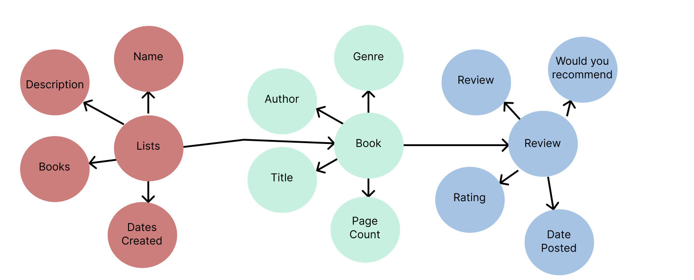

## Purpose of Conceptual Model

**Purpose of a conceptual model:** A conceptual model defines the core attribtues in your app, and how they relate.

**Entity:** A person, place, object that we want store information about.

**Attribute:** A piece of information that describes an entity.

**Relationship:** Shows how entities are connected.

## Conceptual Model

## Description

A List entity represents a collection of books that a user has grouped together, suhc as a themed reading list. Its attributes are list name, description, and date created.