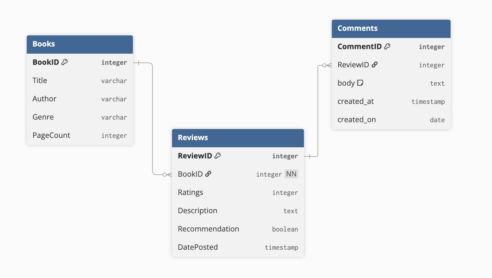

# Database Design - Assignment 2 - Logical Model

## Logical Model Terms

**Purpose of a logical model** - The purpose of the logical model is to organize and structure your database.

**Primary Key** - A primary key is an attribute that uniquely identifies every instance of an entity.

**Foreign Key** - A foreign key is an attribute in one entity that references a primary key of another entity

**Relationships between entities** - Relationships between two entities show how two entities are associated with each other, and how instances within an entity relate to another.

**Normalization** - Normalization organizes data to reduce duplicated information, and helps keep a cleaner online environment.

## Group Conceptual Model

[Click here to view our conceptual model](https://github.com/Saucy-tgossett/WinSupply/blob/gossett-conceptualmodel/conceptual-model/lastname-cmh.md)

## Logical Model

In my logical model, I have three entities, books, reviews and comments. Book is an entity because it represents an object, with its own attributes, title, author, genre, pagecount, and its own primary key, BookID. Reviews representing a concept, with tis own attributes, ratings, description, recommendation, dateposted, and its own key ReviewID. A review depends on a book to exist, a single book can have many reviews but a review cannot attach to nothing. Comments being an entity aswell, following the same logic as the rest of the entities, having its own primary key, CommentID, and its own attributes, body, created_at, created_on. Which also depends on reviews the same way a review depends on the books.