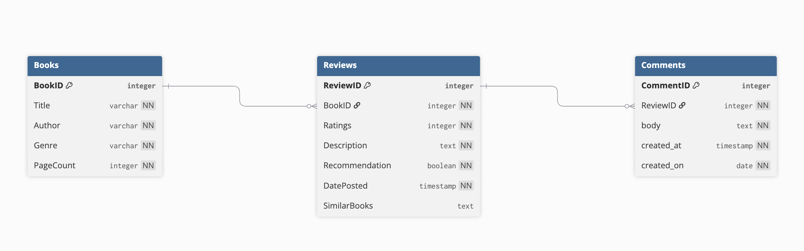

# Physical Model

## Physical vs Logical/Conceptual

The logical data model is an extension of the conceptual data of a specific business process. Meanwhile a **Physical Models** refines that logical data model for database design.

## Common Data Types

- **Numeric Data types**: From integers, to floats, to bits.
- **Boolean Data types**: Zero meaning false, and non-zero meaning true.
- **String Data types**: String types can hold any string data including plain text, and binary data and contents of a file.
- **Temporal Data types**: Representing a date without a time, time without a date, datetime, timestamp and year.
- **Spatial data type**: Contains various kinds of geographical values.

## Default Values / Null Values

- **Default Values**: A default value will be added to all new records.
- **Null Values**: A null value represents a missing, or inapplicable data in a database field. It is not a value, its more of a placeolder to indicate the absence of data.

## Check Constraints

`CHECK` constaints enforce a domain intregrity by limiting values that are accepting by one or more columns.

## Logical Model

[Group Logical Model](https://github.com/Saucy-tgossett/WinSupply/blob/gossett-logicalmodel/logical-model/gossett-lmh.md])

## Physical Model

## Description 

- **Books**: The `book` table will have information stored into it such as, title, author, genre and page count. While  `BookID` being the primary key. `Book` has a one to many relationship with the `Review` table.

- **Review**: The `review` table being where our reviews for books will be stored. `ReviewID` is our primary key, and `BookID` is our foreign key that connects to the books. A book may carry one or more reviews, but each review must belong to one book. All of the attributes must be filled out in our table besides `SimilarBooks` this is an optional feature.

- **Comments**  the `Comment` table is for our comments that are made on reviews. `CommentID` being our primary key, and `ReviewID` being our foregin key. A review can have one or more comments, but each comment will belong to a single review. 

## References
- https://aws.amazon.com/compare/the-difference-between-logical-and-physical-data-model/
- https://www.mariadbtutorial.com/mariadb-basics/mariadb-data-types/
- https://www.w3schools.com/sql/sql_default.asp
- https://www.w3schools.com/sql/sql_null_values.asp
